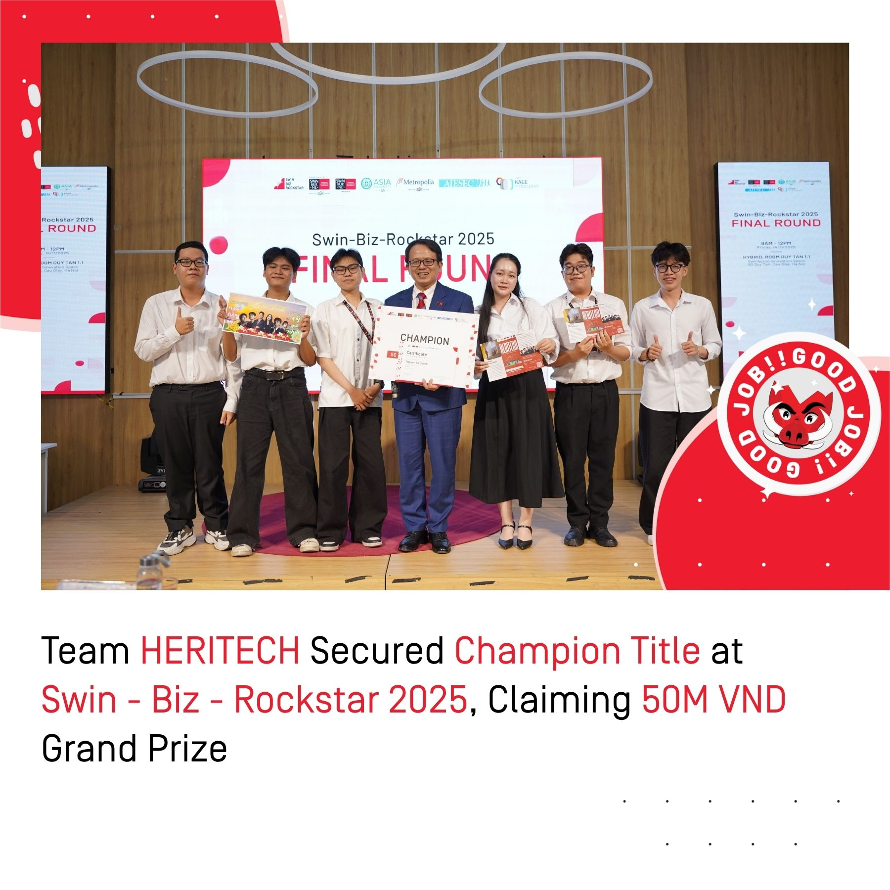
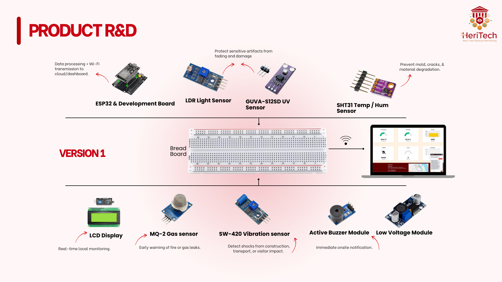
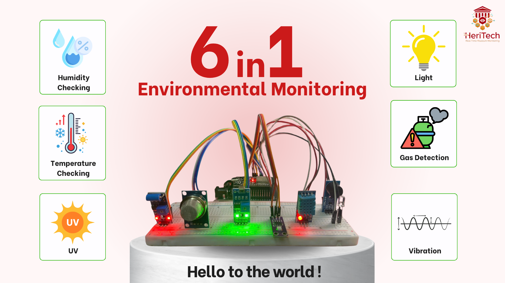
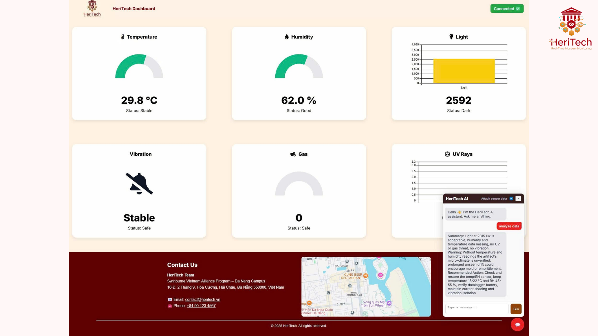
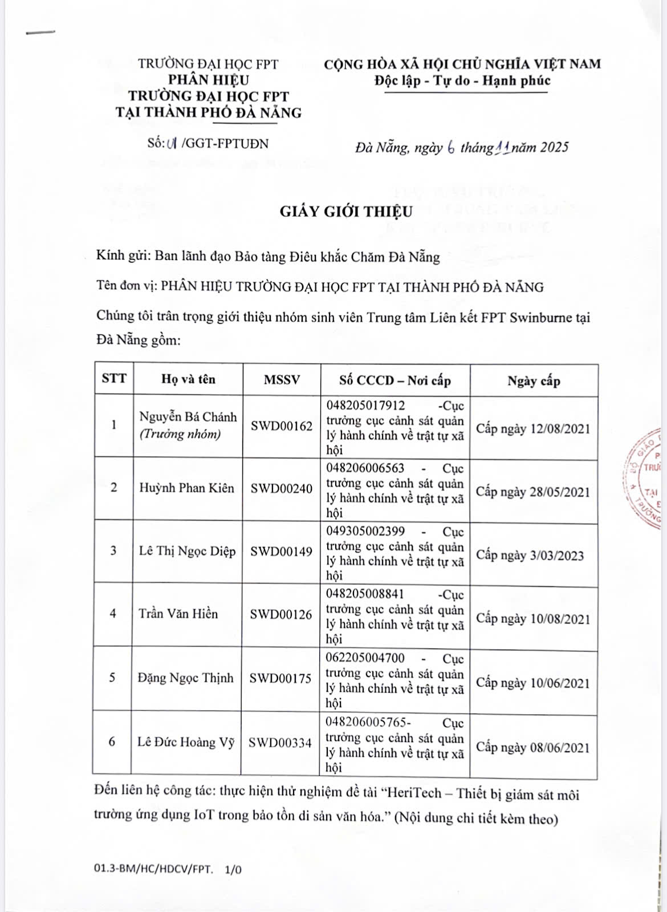
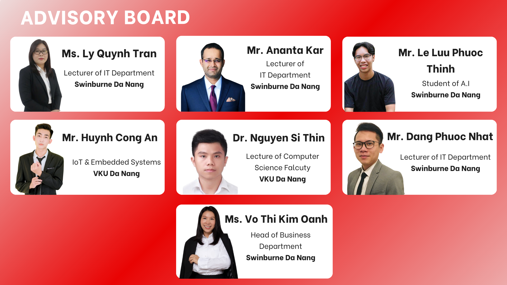

# 🏛️ **HeriTech Dashboard**
### _IoT-Based Environmental Monitoring System for Artifact Preservation_

---

## 🌍 **Project Overview**

**HeriTech Dashboard** is an **IoT-based environmental monitoring system** developed by the **HeriTech Team**, undergraduate students from **Swinburne Vietnam Alliance Program – Danang Campus**.

The project is designed to assist **museum artifact preservation** by **monitoring, analyzing, and automatically responding** to environmental factors such as temperature, humidity, light intensity, UV rays, vibration, and gas concentration.

The ultimate goal is to build a **“Smart Museum”** model that enables real-time data tracking, intelligent analysis, and affordable automation for artifact protection.

---

## 👥 **Team Members**

| Name | Role | Email |
|------|------|--------|
| **Nguyễn Bá Chánh** | Team Leader / Backend & Data Analyst | ------------- |
| **Huỳnh Phan Kiên** | Hardware Developer | ------------- |
| **Lê Thị Ngọc Diệp** | Frontend Developer | ------------- |
| **Trần Văn Hiền** | IoT Engineer | ------------- |
| **Đặng Ngọc Thịnh** | AI & Chatbot Developer | ------------- |
| **Lê Đức Hoàng Vỹ** | Database & Cloud Integration | ------------- |


---

## ⚙️ **System Components**

### 🧩 Main Modules
- **Sensors:**
  - Temperature & Humidity → `DHT11`
  - Light & UV intensity → `Light Sensor`, `GUVA-S12SD`
  - Vibration detection → `SW-420`
  - Gas detection → `MQ-2`
- **Microcontroller:** `ESP32 (30-pin)`
- **Database:** `Firebase Realtime Database`
- **Frontend:** React + Tailwind CSS + Chart.js
- **AI Integration:** ChatGPT API (via n8n workflow automation)

---

## 🧠 **How It Works**

1. IoT sensors collect real-time data from the environment.  
2. ESP32 transmits data to **Firebase Realtime Database**.  
3. The **HeriTech Dashboard** (React + Tailwind CSS + Chart.js) visualizes live data in interactive charts.  
4. **n8n Automation** acts as a middleware — sending user queries to **ChatGPT API** and returning AI-generated insights or suggested actions.  
   > Example: “UV intensity exceeds the safe threshold — please close the curtain to protect artifacts.”


---

## 🧾 **Key Features**

✅ Real-time monitoring of temperature, humidity, light, UV, gas, and vibration  
✅ Automatic alerts when thresholds are exceeded  
✅ Visualized analytics using **Chart.js**  
✅ Cloud data storage via **Firebase**  
✅ AI chatbot assistance through **ChatGPT API**  
✅ Fully responsive and mobile-friendly dashboard  


---

## 🧮 **Technologies Used**

| Category | Technologies |
|-----------|---------------|
| Frontend | React.js, Tailwind CSS, Chart.js |
| Backend / Cloud | Firebase Realtime Database |
| IoT Hardware | ESP32, DHT11, GUVA-S12SD, MQ-2, SW-420 |
| AI / Automation | ChatGPT API, n8n Workflow |
| Languages | JavaScript, HTML, CSS |
| Data Visualization | Chart.js |



---

## 🧩 **System Architecture**

```text
[ IoT Sensors ] → [ ESP32 ] → [ Firebase Database ]
                              ↘
                               → [ HeriTech Dashboard (React) ]
                                ↘
                                 → [ n8n Workflow ] → [ ChatGPT API ]
```
---

## ⚖️ **License & Institutional Acknowledgment**

### 🏫 Institutional Copyright Notice

© 2025 **HeriTech Team** – *Swinburne Vietnam Alliance Program, Danang Campus*  
In collaboration with:  
- **Cham Sculpture Museum – Danang City**  
- **Center for Science and Technology Application and Standard Measurement and Quality (SMEQC) – Danang**

All rights reserved.  
This project is developed under the academic and research supervision of **Swinburne Vietnam (Danang Campus)** and in technical partnership with **Cham Sculpture Museum** and **SMEQC Danang**.

### 📜 License Terms

This repository and its contents (source code, documentation, and design assets) are licensed for:
- **Educational and research purposes only**  
- **Non-commercial use**, as part of the HeriTech environmental monitoring initiative  
- **Attribution required** when reproducing or referencing the system, in any report, article, or presentation.

Unauthorized duplication, redistribution, or commercial adaptation of this project or any part thereof is **strictly prohibited** without written permission from the institutions listed above.

### 🧾 Citation Reference

If you reference or reuse this project in publications or exhibitions, please cite as:

> HeriTech Team (2025). *HeriTech Dashboard: IoT-Based Environmental Monitoring for Artifact Preservation.*  
> Swinburne Vietnam Alliance Program – Danang Campus, in collaboration with Cham Sculpture Museum and SMEQC Danang.

---

### 🏛️ Institutional Endorsement

This project has been developed under the academic guidance of  
**Swinburne Vietnam Alliance Program – Danang Campus**,  
with field collaboration from **Cham Sculpture Museum** and **SMEQC Danang**,  
to promote the application of **IoT and AI** in the **preservation of cultural heritage**.

<table align="center">
  <tr>
    <td align="center" width="50%">
      
      <br>
      <i>Swinburne Vietnam Alliance Program License</i>
    </td>
    <td align="center" width="50%">
      
      <br>
      <i>Cham Museum & SMEQC Danang Collaboration</i>
    </td>
  </tr>
</table>

---

## 🧠 **Advisory Board & Acknowledgment**

The **HeriTech Team** sincerely expresses gratitude to our mentors, academic institutions, and partner organizations who have provided continuous guidance, feedback, and technical support throughout the research and development of this project.

### 🏫 **Advisory & Institutional Support**

We gratefully acknowledge the collaboration and support from:
- **Swinburne Vietnam Alliance Program – Danang Campus**
- **Cham Sculpture Museum – Danang City**
- **Center for Science and Technology Application and Standard Measurement and Quality (SMEQC) – Danang**

These institutions have provided academic supervision, technical consultation, and domain expertise in museum conservation and IoT application for heritage environments.

### 🤝 **Community & Collaborative Support**

We also extend our appreciation to the university’s innovation clubs, student communities, and research groups who encouraged our team’s exploration and experimentation in combining **IoT, AI, and data science** for cultural heritage preservation.




---

<p align="center">
  <i>"Together, we innovate for heritage preservation — where technology meets culture."</i>
</p>

---

